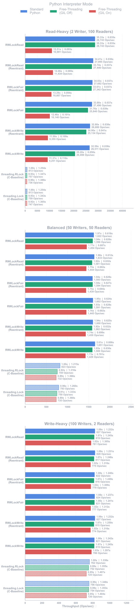
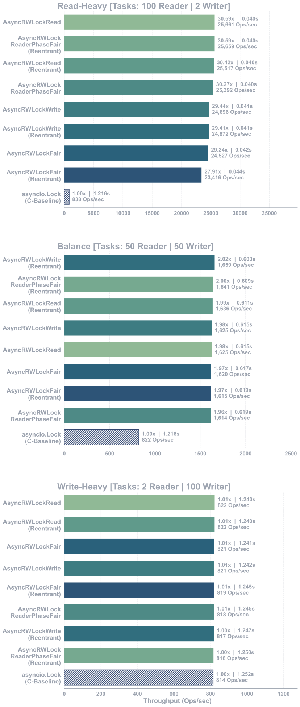
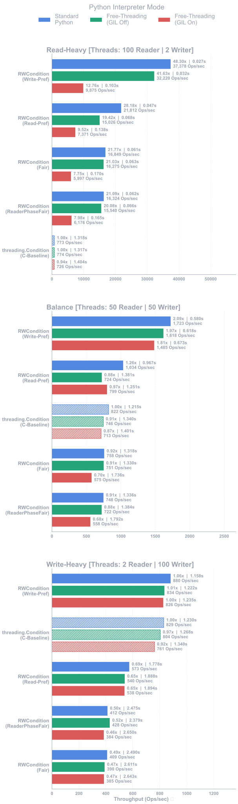
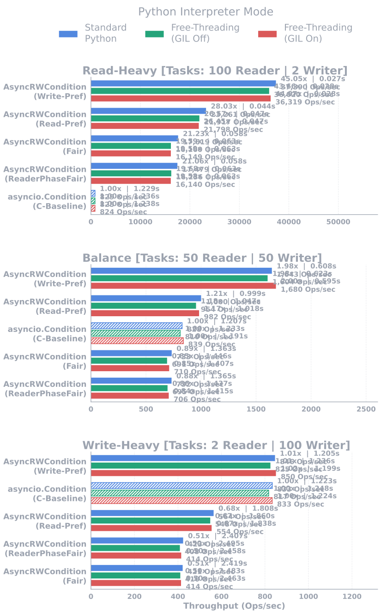

[![Contributors][contributors-shield]][contributors-url]
[![Forks][forks-shield]][forks-url]
[![Stargazers][stars-shield]][stars-url]
[![Issues][issues-shield]][issues-url]
[![MIT License][license-shield]][license-url]
[![LinkedIn][linkedin-shield]][linkedin-url]

[Русский][lang-ru-url] | [English][lang-en-url] | [Türkçe][lang-tr-url]


<!-- About -->
<div align="center">


<h3 align="center">Python RWLocker</h3>

<p align="center">

Продвинутые, высокопроизводительные синхронные/асинхронные блокировки чтения-записи (Read-Write Locks) на основе конечных автоматов.

[Changelog][changelog-url] · [Report Bug][issues-url] · [Request Feature][issues-url]
 
</p>

</div>

<br/>

## 📋 О проекте

### 🚀 Почему RWLocker?

Стандартные блокировки в Python (`Lock`, `RLock`) являются **Эксклюзивными (Exclusive)**. Даже если к ним обратятся 100 читателей (например, потоков, извлекающих данные из базы данных), они будут вынуждены выполнять эти операции последовательно, один за другим.

В свою очередь, `rwlocker` основан на логике **Совместного (Shared)** чтения. В то время как блокировки писателей эксклюзивны, блокировки читателей позволяют тысячам потоков или задач получать доступ к данным одновременно, не блокируя друг друга. Это раскрывает истинный потенциал системы, особенно во время операций ввода-вывода (Сеть/Диск/База данных), где снимается GIL (Global Interpreter Lock).

### 🚀 А как насчет условных переменных (Condition)?
Стандартные структуры `Condition` в библиотеке при вызове `notify_all()` пробуждают все ожидающие потоки/задачи с временной сложностью O(N) (сканируя их один за другим). Это создает **«Шторм кеша» (Cache Stampede)**, который блокирует процессор в сценариях, когда одновременно пробуждаются сотни читателей. `rwlocker` полностью работает на архитектуре очередей на базе `deque` (Thread) и `dict` (Asyncio). Он устраняет штормы на архитектурном уровне, пробуждая ожидающие задачи с чистой **временной сложностью O(1)** без блокировки ОС или цикла событий (event-loop).

### ✨ Основные возможности

* **Поддержка как Thread, так и Asyncio:** Вы можете управлять как стандартными потоками ОС (`rwlocker.thread_rwlock`), так и задачами на основе цикла событий (`rwlocker.async_rwlock`), используя абсолютно одинаковую логику API.
* **Архитектура умных прокси (Smart Proxy Architecture):** Интуитивно понятное использование контекстных менеджеров `with` и `async с` через прокси `.read` и `.write`.
* **Атомарное понижение уровня (Downgrading):** Возможность мгновенно понизить блокировку Записи до блокировки Чтения (`downgrade()`), не освобождая блокировку полностью и не позволяя другим писателям вмешаться.
* **Безопасная реентерабельность (Safe Reentrancy):** Отслеживание указателей памяти за O(1), позволяющее одному и тому же потоку или задаче многократно получать блокировку записи без возникновения взаимной блокировки (Deadlock).
* **Чистые переменные условия O(1) (Pure O(1) Conditions):** В отличие от стандартных структур `Condition`, не перебирает список ожидания по одному во время вызовов `notify_all()` (избегая затрат на сканирование O(N)). Благодаря специализированной микроочередной архитектуре на уровне C, мгновенно пробуждает тысячи задач, не вызывая «Шторм кеша» (Cache Stampede) и не перегружая CPU.
* **Асинхронная безопасность при отмене (Cancellation Safety & Shielding):** Полная устойчивость к отменам задач (`CancelledError`) в среде `asyncio`. Если задача отменяется во время ожидания блокировки или внутри `Condition.wait()`, состояние системы никогда не повреждается. Блокировка безопасно восстанавливается, «зомби»-ожидающие не образуются, а очереди ожидания остаются абсолютно чистыми.
* **100% Drop-in замена (Drop-in Replacement):** Вы можете внедрять свои продвинутые блокировки (`RWLockFair` и др.) и условные переменные (`RWCondition` и др.) напрямую в сторонние библиотеки (SQLAlchemy, requests, FastAPI и др.), ожидающие стандартные экземпляры `threading.Lock`, `asyncio.Lock`, `threading.Condition` или `asyncio.Condition`, не внося никаких изменений в код. Стандартные вызовы API (например, `lock.acquire()`, `cond.wait()`) автоматически и безопасно перенаправляются на эксклюзивный прокси `.write`.
* **Изоляция производительности "Happy Path":** Архитектура нового поколения, которая полностью обходит дорогостоящие (O(N)) операции по очистке мусора при успешных пробуждениях блокировок и очередей. Обеспечивает абсолютную защиту от прерываний ОС (OS-Interrupts) и таймаутов, завершая успешные пробуждения с нулевой дополнительной нагрузкой на CPU.
* **Стандартные адаптеры (Standard Adapters):** Включает стандартные обертки для процессов внедрения зависимостей (Dependency Injection), когда вы хотите сохранить ту же архитектурную сигнатуру (`.read` и `.write`), но не нуждаетесь в сложных стратегиях блокировки.
    * *Адаптеры блокировок:* `Lock` (Thread), `AsyncLock` (Asyncio)
    * *Адаптеры Condition:* `Condition` (Thread), `AsyncCondition` (Asyncio)

### 🛡️ Стратегии блокировок

Вы можете выбрать правильную стратегию блокировки в зависимости от профиля узких мест вашей системы. У каждой стратегии есть вариант `ReentrantWriter`, который допускает реентерабельность.

| Тип стратегии | Имя класса (Thread / Async) | Описание | Когда использовать? |
| --- | --- | --- | --- |
| **Приоритет писателей** | `RWLockWrite` / `AsyncRWLockWrite` | Запрещает доступ новым читателям, если есть ожидающий писатель. Предотвращает голодание писателей. | Чтобы писатели не задыхались в системах с интенсивным чтением. |
| **Приоритет читателей** | `RWLockRead` / `AsyncRWLockRead` | Постоянно впускает новых читателей, даже если писатели ждут. Обеспечивает максимальный параллелизм. | В структурах кэширования, где операции записи очень редки или некритичны. |
| **Справедливая по фазам чтения** | `RWLockReaderPhaseFair` / `AsyncRWLockReaderPhaseFair` | Переключается между фазами чтения и записи, но читатели, пришедшие после открытия фазы чтения, все еще могут присоединиться к ней ради более высокой пропускной способности чтения. | Когда нужна ограниченная справедливость без полного замораживания каждой читательской группы. |
| **Справедливая (Fair)** | `RWLockFair` / `AsyncRWLockFair` | Фиксирует состав каждой фазы чтения в момент ее открытия, поэтому поздние читатели не могут вклиниться перед уже ожидающим писателем. Предотвращает голодание обеих сторон и делает задержку писателя более детерминированной. | При высокочастотном двунаправленном трафике (MAVLink, WebSockets и др.), когда важна предсказуемая задержка писателя. |
> 💡 **Совместимость с Condition (Condition Compatibility):** Классы `RWCondition` и `AsyncRWCondition` в библиотеке разработаны так, чтобы инкапсулировать все вышеупомянутые стратегии блокировок (Dependency Injection). Вы можете выбрать блокировку, которая лучше всего подходит для вашей системы, и превратить ее в конечный автомат, работающий со скоростью чистого O(1).
<br/>

## ⚙️ Архитектурные ограничения

Инженерные факты, которые необходимо знать разработчикам при использовании этой библиотеки:

1. **Реальность CPU-Bound и I/O-Bound:**
`rwlocker` черпает свою мощь из моментов, когда Python снимает GIL (Global Interpreter Lock) (Сетевые запросы, запросы к БД, файловый ввод-вывод и т.д.). Если вы ищете блокировку для чисто тяжелых математических вычислений (CPU-Bound), которые не используют уступки I/O вроде `time.sleep()`, вы не достигнете истинного параллелизма из-за GIL, и стандартный C-ориентированный `threading.Lock` будет немного быстрее. **Истинное поле битвы RWLock — это операции ввода-вывода (I/O).**
2. **Циклические ссылки (Circular References):**
Классы блокировок создают граф циклических ссылок (Lock -> Proxy -> Lock) при создании смарт-прокси-объектов (`.read` и `.write`). Такой дизайн используется преднамеренно. Очистка памяти (Garbage Collection) безопасно выполняется механизмом циклической сборки мусора Python, а не через `__del__`.
3. **Строго вложенные блокировки записи:**
В вариантах `ReentrantWriter` могут быть вложены только блокировки «Записи» (Write). Если писатель хочет получить блокировку на чтение, он не может сделать это неявно; он должен явно вызвать метод `.downgrade()`. Это строгое архитектурное решение, принятое для предотвращения взаимных блокировок на структурном уровне.
4. **Цена справедливости (The Cost of Fairness):**
Если вы используете стратегию `Fair`, система принудительно переключает контекст между читателями и писателями на основе строгой очереди, гарантируя, что никто не останется голодать (No Starvation). Особенно в сценариях с использованием **`RWCondition`** и интенсивной записью, эти усилия по поддержанию справедливого порядка вызывают определенное замедление по сравнению со стандартным объектом `Condition` на базе C, не имеющим правил (именно поэтому Fair набирает 0.50x в бенчмарках). Это не ошибка и не недостаток оптимизации; это инженерная цена, уплачиваемая за «справедливость».
5. **Компромисс памяти и CPU для Condition (Memory vs CPU Trade-off):**
В то время как стандартный `threading.Condition` использует простой счетчик уровня C в фоновом режиме, `rwlocker` хранит крошечный объект `Lock` или `asyncio.Future` в памяти для каждой ожидающей задачи/потока, гарантируя скорость пробуждения O(1). Это полностью устраняет узкие места процессора (Cache Stampede), но в экстремальных случаях, когда ожидают десятки тысяч задач, это создает небольшой объем используемой памяти в RAM.
6. **Допущение безопасности при Drop-in замене (Drop-in Security Assumption):**
Если вы используете объекты блокировок напрямую, как стандартную блокировку, не указывая прокси `.read` или `.write` (например, `with lock:` или `await cond.wait()`), система автоматически захватывает блокировку **записи (Эксклюзивную)** для обеспечения обратной совместимости и абсолютной безопасности данных. Это подход "Безопасно по умолчанию" (Secure by Default), внедренный, чтобы не позволить внешним библиотекам повредить данные.

<br/>

## 📊 Результаты производительности и бенчмарков

Приведенные ниже бенчмарки демонстрируют истинный потенциал `rwlocker` во время операций ввода-вывода с сетью и БД, когда GIL (Global Interpreter Lock) Python снимается или переключается контекст.

**🖥️ Тестовая среда:** Все тесты выполнялись на процессоре **Intel Core i7-12700H (2.4GHz)** под управлением **EndeavourOS (Linux на базе Arch)**, с использованием интерпретаторов **Python 3.14.3** и экспериментального **Free-Threading (3.14.3t)**.

**🧪 Методология тестирования:** Чтобы обеспечить абсолютную точность и нулевую погрешность, все сущности читателей и писателей (потоки или асинхронные задачи) создаются заранее и удерживаются на стартовой линии с помощью барьера синхронизации `Event` (Событие). Как только событие срабатывает, они начинают выполнение одновременно. Рабочие нагрузки строго следуют сценарию `IOBoundScenario`, который применяет точную задержку `time.sleep(0.001)` или `asyncio.sleep(0.001)` на протяжении 10 последовательных итераций для точного моделирования реальной задержки ввода-вывода сети/БД.

### 1. Сравнение блокировок чтения-записи (RWLock)

Стандартные блокировки вынуждают потоки выстраиваться в одну очередь, даже если они только читают данные. `rwlocker` открывает одновременный доступ на чтение.

**Производительность синхронного (Thread) RWLock:**
В сценариях Read-Heavy (интенсивное чтение) стандартные блокировки на базе C душат систему, тогда как `rwlocker` достигает **ускорения до ~35 раз**. Даже в рабочих нагрузках Write-Heavy (интенсивная запись), где параллелизм по своей природе невозможен, `rwlocker` соответствует или немного превосходит базовый уровень C благодаря быстрому пути без аллокаций (zero-allocation). Обратите внимание, насколько мощно масштабируется экспериментальный режим Free-Threading (GIL Off)!
<p align="center">
  
</p>
<br>

**Производительность асинхронного (Asyncio) RWLock:**
Поскольку асинхронные задачи выполняются конкурентно в одном цикле событий, режимы интерпретатора (GIL вкл/выкл) не сильно меняют результаты. Таким образом, асинхронные метрики демонстрируют самую высокую производительность. Здесь `rwlocker` достигает **пропускной способности в ~30 раз быстрее**, позволяя тысячам задач-читателей одновременно ожидать ввода-вывода, не блокируя друг друга.
<p align="center">
  
</p>
<br>

### 2. Сравнение условных переменных (RWCondition)

Стандартные переменные `Condition` перебирают все спящие потоки/задачи по одному `O(N)` во время трансляции (`notify_all`), вызывая массовые всплески CPU и "Штормы кеша" (Cache Stampedes). `rwlocker` полностью искореняет это с помощью своей чистой архитектуры очередей `O(1)`.

**Производительность синхронного (Thread) RWCondition:**
Когда 100 спящих читателей пробуждаются одновременно, `rwlocker` обрабатывает их мгновенно, не блокируя ОС. Этот архитектурный скачок приводит к **ускорению в ~45 раз** по сравнению с `threading.Condition` из стандартной библиотеки.
<p align="center">
  
</p>
<br>

**Производительность асинхронного (Asyncio) RWCondition:**
В системах кэширования, управляемых событиями, одновременное пробуждение сотен ожидающих веб-запросов является серьезным узким местом. `AsyncRWCondition` полностью обходит стандартные ограничения asyncio, достигая **пропускной способности в ~45 раз выше** во время сценариев массовой трансляции, полностью спасая цикл событий от зависания.
<p align="center">
  
</p>
<br>

*(Примечание: Все классы блокировок, адаптеров и условий прошли массивный набор из **412 различных модульных тестов (unit tests)**, охватывающих реентерабельность, взаимные блокировки, таймауты, прерывания ОС, утечки O(N) и сценарии безопасности при отмене с 0 ошибок, и весь этот набор тестов был завершен всего за **15.7 секунды**.)*

<br/>

## 🚀 Начало работы

### 🛠️ Зависимости

* Нет внешних зависимостей.
* Только стандартная библиотека Python (`threading`, `asyncio`, `typing`, `collections`).
* Полностью совместим с Python 3.9+.

### 📦 Установка

Библиотека не имеет внешних зависимостей и работает напрямую с базовыми библиотеками Python.

1. Клонировать репозиторий
    ```sh
    git clone https://github.com/TahsinCr/python-rwlocker.git
    ```

2. Установить через PIP
    ```sh
    pip install rwlocker
    ```

<br/>

### 💻 Примеры использования

#### 1. Кэш в памяти с высокой конкурентностью (Read-Heavy)

Предотвращает ожидание читателями друг друга на веб-сервере, обрабатывающем тысячи запросов.

```python
import threading
import time
from typing import Any, Dict, Optional
from rwlocker.thread_rwlock import RWLockRead

class InMemoryCache:
    def __init__(self):
        self._lock = RWLockRead()
        self._cache: Dict[str, Any] = {}

    def get(self, key: str) -> Optional[Any]:
        # Читатели НИКОГДА не блокируют друг друга, максимизируя пропускную способность!
        with self._lock.read:
            time.sleep(0.01) # Симуляция сети или сериализации (I/O)
            return self._cache.get(key)

    def set(self, key: str, value: Any) -> None:
        # Захватывает эксклюзивную блокировку записи. Безопасно приостанавливает новых читателей.
        with self._lock.write:
            self._cache[key] = value

# ИСПОЛЬЗОВАНИЕ
cache = InMemoryCache()
cache.set("status", "ONLINE")

# Эти 50 потоков могут читать одновременно без ожидания.
threads = [threading.Thread(target=cache.get, args=("status",)) for _ in range(50)]
for t in threads: t.start()

```

#### 2. Атомарное понижение состояния (Downgrading) в финансовых реестрах

Идеально подходит для обновления данных (Write) и немедленного чтения/аудита тех же данных (Read) без возможности вмешательства другого писателя.

```python
import uuid
from rwlocker.thread_rwlock import RWLockWriteReentrantWriter

class TransactionLedger:
    def __init__(self):
        self._lock = RWLockWriteReentrantWriter()
        self._balance = 1000.0

    def process_payment(self, amount: float):
        self._lock.write.acquire()
        try:
            # ФАЗА 1: Эксклюзивная запись (Обновление баланса)
            self._balance += amount
            
            # АТОМАРНЫЙ DOWNGRADE: Блокировка записи понижается до блокировки чтения.
            # Ожидающие читатели допускаются, но другие ПИСАТЕЛИ строго блокируются.
            self._lock.write.downgrade()
            
            # ФАЗА 2: Совместное чтение (Трансляция другим сервисам по сети)
            self._dispatch_audit_event(self._balance)
            
        finally:
            # Поскольку мы понизили уровень, теперь мы должны освободить блокировку READ.
            self._lock.read.release()

    def _dispatch_audit_event(self, balance: float):
        print(f"Аудиторский отчет отправлен. Новый баланс: {balance}")

```

#### 3. Обновление токена JWT (Решение проблемы Thundering Herd)

Предотвращает падение сервера авторизации из-за одновременного пробуждения сотен задач для обновления истекшего токена (Thundering Herd).

```python
import asyncio
from rwlocker.async_rwlock import AsyncRWLockWrite

class AuthTokenManager:
    def __init__(self):
        self._lock = AsyncRWLockWrite()
        self._token = "valid_token"
        self._is_expired = False

    async def get_valid_token(self) -> str:
        # Быстрый путь: Если токен действителен, 500 задач проходят здесь одновременно без ожидания.
        async with self._lock.read:
            if not self._is_expired:
                return self._token
                
        # Медленный путь: Срок действия токена истек. Захват блокировки записи.
        async with self._lock.write:
            # Блокировка с двойной проверкой: Пока мы ждали блокировку, 
            # другая задача могла войти и обновить токен.
            if self._is_expired:
                print("Обновление токена...")
                await asyncio.sleep(0.5)  # API запрос
                self._token = "new_valid_token"
                self._is_expired = False
                
            return self._token

```

#### 4. Высокочастотная телеметрия (Справедливое распределение)

Данные поступают от датчика 100 раз в секунду (Write), а 200 веб-сокетов читают эти данные (Read). Архитектура Fair (Справедливая) предотвращает голодание обеих сторон.

```python
import asyncio
from typing import Dict
from rwlocker.async_rwlock import AsyncRWLockFair

class TelemetryDispatcher:
    def __init__(self):
        # Fair предотвращает взаимное подавление интенсивности чтения и записи.
        self._lock = AsyncRWLockFair()
        self._state = {"alt": 0.0, "lat": 0.0, "lon": 0.0}

    async def ingest_sensor_data(self, new_data: Dict[str, float]):
        """Записывает входящие данные из высокочастотного UDP-потока."""
        async with self._lock.write:
            self._state.update(new_data)
            await asyncio.sleep(0.001)

    async def broadcast_to_clients(self):
        """Читает данные параллельно для десятков websocket-клиентов."""
        async with self._lock.read:
            # Безопасно скопировать состояние для минимизации времени удержания блокировки
            current_state = self._state.copy()
            
        # Выполнять медленные сетевые I/O операции, пока блокировка снята
        await self._network_send(current_state)

    async def _network_send(self, data):
        await asyncio.sleep(0.05) # Симуляция сетевой задержки

```

#### 5. Обновление кэша на основе событий (Thundering Herd Protection)

Если тысячи задач попытаются одновременно получить просроченный токен из БД, БД рухнет. С `AsyncRWCondition` пока 1 задача обновляет данные, остальные 999 задач безопасно спят, не перегружая CPU (со скоростью O(1)), и затем пробуждаются все сразу.

```python
import asyncio
from rwlocker.async_rwlock import AsyncRWLockRead, AsyncRWCondition

class GlobalConfigCache:
    def __init__(self):
        # Мы используем блокировку Read-Pref, потому что чтение очень интенсивно
        self._cond = AsyncRWCondition(AsyncRWLockRead())
        self._config = {}
        self._is_refreshing = False

    async def get_config(self) -> dict:
        """Вызывается тысячами конкурентных запросов."""
        async with self._cond.read:
            # Если выполняется обновление БД, безопасно спать и ждать, вместо того чтобы бомбардировать БД.
            # Метод wait_for автоматически обрабатывает сценарии ложных пробуждений (Spurious Wakeup).
            await self._cond.read.wait_for(lambda: not self._is_refreshing)
            return self._config

    async def force_refresh_from_db(self) -> None:
        """Работает эксклюзивно при вызове через webhook."""
        async with self._cond.write:
            self._is_refreshing = True
            
            await asyncio.sleep(0.5) # Симуляция медленного запроса к базе данных
            self._config = {"theme": "dark", "version": 2}
            self._is_refreshing = False
            
            # Пробуждает ТЫСЯЧИ ожидающих задач-читателей со скоростью O(1). Никакой давки!
            self._cond.write.notify_all()
```


#### 6. Точная очередь заданий (Thread Condition & Targeted Wake-up)

Когда в систему поступают 3 новых задания, вместо пробуждения всех 50 простаивающих рабочих потоков (проблема "Thundering Herd"), выполняется целевое пробуждение вызовом только `notify(n=3)`.

```python
from collections import deque
import threading
from rwlocker.thread_rwlock import RWLockFair, RWCondition

class ImageProcessingQueue:
    def __init__(self):
        # Стратегия Fair для предотвращения подавления друг друга производителями и потребителями
        self._cond = RWCondition(RWLockFair())
        self._queue = deque()

    def add_jobs(self, jobs: list[str]):
        """Производитель (Producer): Добавляет новые задания в очередь."""
        with self._cond.write:
            self._queue.extend(jobs)
            
            # УМНЫЙ СИГНАЛ: Пробудить столько потоков, сколько поступило новых заданий.
            # Остальные спящие потоки в системе не будут тратить такты CPU.
            self._cond.write.notify(n=len(jobs))

    def consume_job(self):
        """Потребитель (Consumer): Спит, пока не появится задание, затем забирает его."""
        with self._cond.read:
            # Безопасно ожидать, если в очереди нет заданий
            self._cond.read.wait_for(lambda: len(self._queue) > 0)
            job = self._queue.popleft()

        # Выполнить тяжелую обработку ПОСЛЕ снятия блокировки.
        print(f"Обработка: {job}")

```

#### 7. 100% Совместимость с Drop-in Replacement

Внедрите мощь `rwlocker` в вашу систему, не меняя существующий (legacy) код или сторонние библиотеки, которые ожидают стандартный `threading.Lock` или `asyncio.Lock`.

```python
import threading
from rwlocker.thread_rwlock import RWLockFair, Lock

# Сценарий: Сторонняя функция ожидает стандартный threading.Lock
def third_party_worker(standard_lock: threading.Lock, data: list):
    # Внешняя библиотека не знает о прокси ".write" или ".read".
    # Она напрямую использует "with lock:".
    with standard_lock:
        data.append("Processed")
        print("Блокировка захвачена через стандартный API!")

# МЕТОД 1: Вы можете передать продвинутый объект RWLock напрямую!
# RWLockFair обнаруживает эти вызовы и автоматически переключается в 
# режим .write (эксклюзивный), поскольку это самое безопасное допущение.
advanced_lock = RWLockFair()
third_party_worker(advanced_lock, [])

# МЕТОД 2: Если вам нужно только стандартное поведение блокировки, 
# вы можете использовать стандартные адаптеры с той же сигнатурой.
simple_adapter_lock = Lock()
third_party_worker(simple_adapter_lock, [])
```

*Для дополнительных примеров, пожалуйста, загляните в директорию [examples][examples-url].*

Полный список предлагаемых функций (и известных проблем) смотрите в разделе [открытых проблем (issues)][issues-url].

<br/>

## 🤝 Вклад в проект (Contributing)

Сообщество open-source — это идеальное место для расширения границ таких низкоуровневых высокопроизводительных библиотек. Любой ваш вклад, который сделает `rwlocker` быстрее, безопаснее или функциональнее, очень ценится!

Мы особенно ждем вашего вклада в следующих областях:

* ⚡ **Оптимизация производительности:** Алгоритмические подходы, которые еще больше снизят накладные расходы (overhead).
* 🏗️ **Специфичные для сценариев улучшения:** Создание и разработка вариантов механизмов блокировки, оптимизированных под различные сценарии.
* 🐛 **Тестирование крайних случаев (Edge-Case):** Новые и строгие модульные тесты для обнаружения сценариев взаимных блокировок (deadlock) или голодания (starvation).

Если у вас есть отличная идея или решение, пожалуйста, выполните следующие шаги для создания **Pull Request (PR)**. Вы также можете открыть Issue с тегом "enhancement", чтобы предложить новую функцию.

Не забудьте поставить проекту **Звезду (⭐)** в правом верхнем углу, если он оказался вам полезен. Спасибо за поддержку!

### 🛠️ Шаги для внесения вклада

1. Сделайте **Fork** проекта в свой аккаунт.
2. Создайте свою ветку (Feature Branch):
```sh
git checkout -b feature/AmazingFeature

```


3. Сделайте **Commit** ваших изменений (Старайтесь использовать описательные сообщения):
```sh
git commit -m 'feat: Добавлена новая оптимизация с затратами O(1) для AsyncRWLock'

```


4. Отправьте изменения в ветку (**Push**):
```sh
git push origin feature/AmazingFeature

```


5. Откройте **Pull Request** в этом репозитории.

> ⚠️ **Важное примечание для разработчиков:** Архитектура `rwlocker` крайне чувствительна к сценариям *deadlock*, *прерываниям ОС (OS-Interrupts)* и *реентерабельности*. Перед открытием PR, пожалуйста, убедитесь, что все **412+ модульных тестов (unit tests)** в проекте проходят без ошибок и ваш код соответствует стандартам **Python 3.9+**.

<br/>

## 🙏 Благодарности и Лицензия

Этот проект полностью с открытым исходным кодом под **лицензией MIT** ([License][license-url]).

Спасибо всему open-source сообществу Python за то, что помогли нам столкнуться с самыми глубокими реалиями Python C-API во время разработки архитектур тестирования и бенчмарков.

* **PyPI:** [RWLocker на PyPI][pypi-project-url]
* **Исходный код:** [Tahsincr/python-rwlocker][project-url]

Если вы найдете какие-либо ошибки или захотите внести архитектурный вклад, не стесняйтесь открыть Issue или отправить Pull Request на GitHub!

<br/>


## 📫 Контакты

X: [@TahsinCrs][x-url]

Linkedin: [@TahsinCr][linkedin-url]

Email: TahsinCrs@gmail.com


<!-- IMAGES URL -->

[contributors-shield]: https://img.shields.io/github/contributors/TahsinCr/python-rwlocker.svg?style=for-the-badge

[forks-shield]: https://img.shields.io/github/forks/TahsinCr/python-rwlocker.svg?style=for-the-badge

[stars-shield]: https://img.shields.io/github/stars/TahsinCr/python-rwlocker.svg?style=for-the-badge

[issues-shield]: https://img.shields.io/github/issues/TahsinCr/python-rwlocker.svg?style=for-the-badge

[license-shield]: https://img.shields.io/github/license/TahsinCr/python-rwlocker.svg?style=for-the-badge

[linkedin-shield]: https://img.shields.io/badge/-LinkedIn-black.svg?style=for-the-badge&logo=linkedin&colorB=555


<!-- Github Project URL -->

[project-url]: https://github.com/TahsinCr/python-rwlocker

[pypi-project-url]: https://pypi.org/project/rwlocker

[contributors-url]: https://github.com/TahsinCr/python-rwlocker/graphs/contributors

[stars-url]: https://github.com/TahsinCr/python-rwlocker/stargazers

[forks-url]: https://github.com/TahsinCr/python-rwlocker/network/members

[issues-url]: https://github.com/TahsinCr/python-rwlocker/issues

[examples-url]: https://github.com/TahsinCr/python-rwlocker/tree/main/examples

[license-url]: https://github.com/TahsinCr/python-rwlocker/blob/main/LICENSE

[changelog-url]:https://github.com/TahsinCr/python-rwlocker/blob/main/CHANGELOG.md


<!-- Contacts URL -->

[linkedin-url]: https://linkedin.com/in/TahsinCr

[x-url]: https://twitter.com/TahsinCrs


<!-- File URL -->

[lang-tr-url]: https://github.com/TahsinCr/python-rwlocker/blob/main/README_tr.md

[lang-en-url]: https://github.com/TahsinCr/python-rwlocker/blob/main/README.md

[lang-ru-url]: https://github.com/TahsinCr/python-rwlocker/blob/main/README_ru.md
